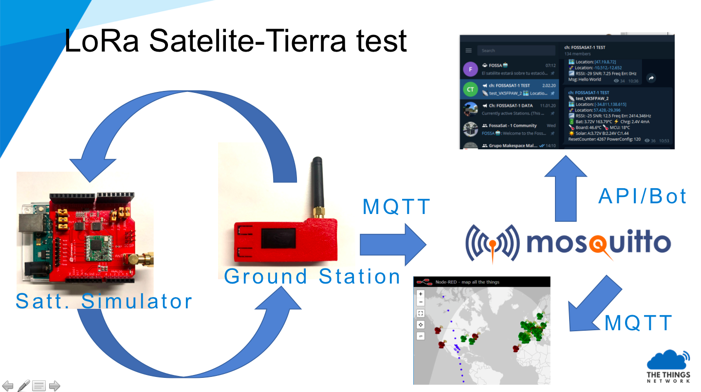

# Test de transmisión LoRa entre satélite y estación terrestre 
Basado en todo el trabajo que se ha hecho en torno al despliegue del satélite amater [Fossasat-1](https://fossa.systems/fossasat-1/). Esta es una recopilación y guia para realizar un test de comunicación de la telemetría usando modulación LoRa entre un satélite y el receptor terrestre.

## _Budget link_ y arquitectura

Resumiendo, este test consiste en la captura de una señal digital emitida en _broadcast_ por la banda de 433 Mhz y modulación lora. Este _downlink_ será decodificado por un dispositivo que además, y a modo de _proxy_; enviará estos datos por Internet utilizando colas MQTT. Finalmente una aplicación _backend_ basada en Node-RED mostrará esta información en un canal de Telegram.

Entrando un poco más en detalle de los elementos utilizados. Hay que decir en primer lugar, que todo el software y hardware utilizado es abierto a excepción del chip modulador/demodulador LoRa con licencia de Semtech.
- Para el **simulador de la señal del satélite**. Partimos de un dispositivo basado en Arduino Uno con un 

## Canales de Telegram
Main community chat: https://t.me/joinchat/DmYSElZahiJGwHX6jCzB3Q
Data channel (station status and received packets): https://t.me/FOSSASAT_DATA
Test channel (simulator packets received by test groundstations): https://t.me/FOSSASAT_TEST
