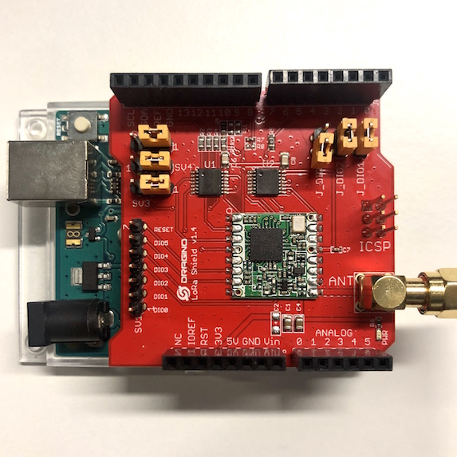
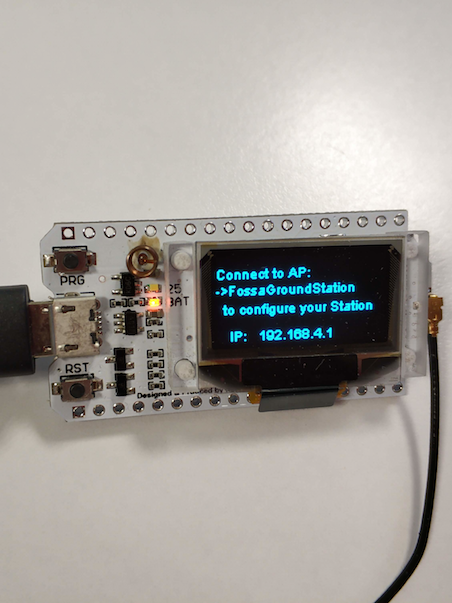
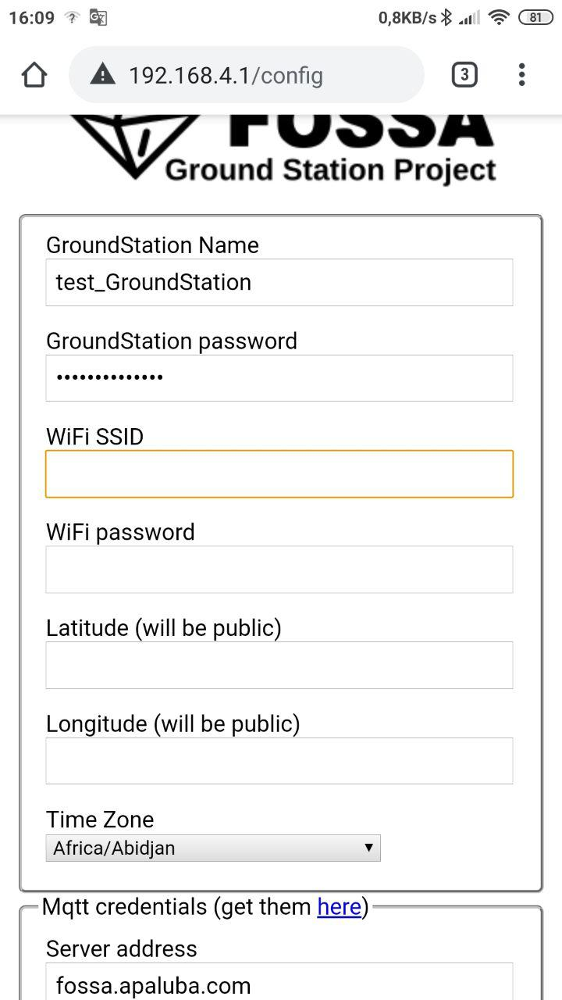
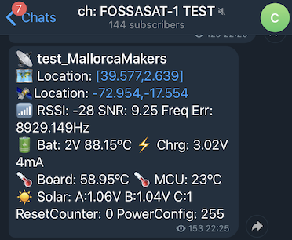
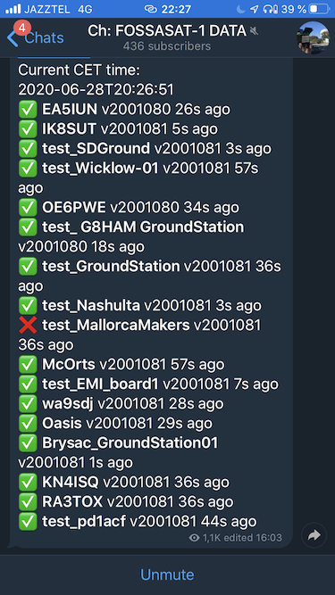
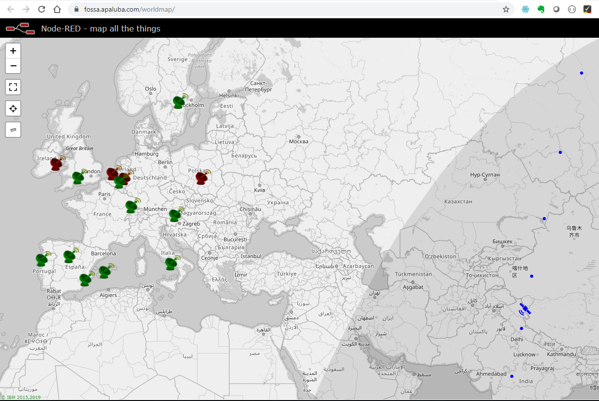

# Test de transmisión LoRa entre satélite y estación terrestre. Simulando comunicaciones de satélite encima de mi mesa.
Basado en todo el trabajo que se ha hecho en torno al despliegue del satélite amater [Fossasat-1](https://fossa.systems/fossasat-1/). Esta es una recopilación y guia para realizar un test de comunicación de la telemetría usando modulación LoRa entre un satélite y el receptor terrestre.

## _Budget link_ y arquitectura

Resumiendo, este test consiste en la interacción entre un receptor real y un dispositivo que simula la comunicaciones en las dos direcciones: _uplink_ hacia el satélite y _downlink_ desde el satélite. Y se utiliza el mismo tipo de señal que el satélite real: la banda de 433Mhz con modulación LoRa. Parte del _payload_ del _downlink_ una vez decodificado por la estación terreste y a modo de _proxy_. Será reenviarado por Internet utilizando colas MQTT. Finalmente una aplicación _backend_ basada en Node-RED mostrará esta información, que básicamente es una telemetría simulada, en un canal de Telegram y situará la estación en un mapa geográfico.

Entrando un poco más en detalle de los elementos utilizados. Hay que decir en primer lugar, que todo el software y hardware utilizado es abierto a excepción del chip modulador/demodulador LoRa con licencia de Semtech.

* Para el **simulador de la señal del satélite**. Partimos de un dispositivo basado en Arduino UNO con una ampliación Dragino LoraHat al que le he soldado el módulo LoRa CXO  DRF1268T basado en el chip sx1268T. Aunque el satélite real utiliza la versión sx1278. Un problema de software del OBC ha determinado que es mejor utilizar este _chipset_. El software de simulación provee las siguientes instrucciones en el _payload_ de la comunicación:   
  * 0x00 trama de _ping_
  * 0x01 telemetría
  * 0x03 _uplink_ de mensaje genérico
  * 0x04 _uplink_ petición reenvío ultimo mensaje.

* Para la **estación terrestre**. Sin embargo, hay varias alternativas de placas a utilizar. Yo he optado por la TTGO LoRa32 V2 (433MHz SX1278) basada en ESP32 que conozco bien. El repositório de código está pensado para trabajar con Platformio sobre VSCode que se ocupa de todas las deplendencias de librerias que con el IDE de Arduino tendríamos que configurar a mano. gracias al magnifico software desarrollado por @G4lile0, la configuraciónd de la estación es una tarea sencilla a la vez que divertida ya que la propia placa presenta una aplicación web en la url 192.168.4.1/config.

 
 
 
 
 
 
 
 
 
 
 
 
 
 
 

## _Demo time_

Una vez configurados y conectados todos los dispositivos y la wifi disponible para la estación terrestre. Solo tendremos que ver como se desarrolla la secuencia de comunicación:
1. El simulador de satélite empezará a emitir inmediatamente.
2. La estación presentará en su visor OLED los datos de señal y telemetría en pantallas sucesivas.

3. Una vez completada la transmisión, el canal de [telegram de test](https://t.me/FOSSASAT_TEST) replicará los datos en un mensaje con la cabecera de nuestro identificador de estación receptora. A la vez, en el [canal general](https://t.me/FOSSASAT_DATA) se mostrará este identicador en la lista de estaciones.
4. Finalmente podremos consultar en la [página web del mapa global](https://fossa.apaluba.com/worldmap) tanto la posición estimada del satélite como la de nuestra estación terrestre.

[Pulsa aquí para ver un video de la secuencia completa](https://github.com/McOrts/fossasat1_satellite-communication-simulation/edit/master/images/Budget-GroundStation-SatelliteSignalSimulator.mov)

# Enlaces
[Repositorio para la estación terrestre](https://github.com/G4lile0/ESP32-OLED-Fossa-GroundStation)
[Repositorio para el simulador de señal](https://github.com/lillefyr/Fossasat-1Simulator)
[Canal de telegram de la Comunidad FOSSA-SAT](ttps://t.me/joinchat/DmYSElZahiJGwHX6jCzB3Q)

# Agradecimientos
- En primer lugar al artífice de casi todo esto, [G4lile0](https://github.com/G4lile0/) un profundo conocedor de la tecnología LoRa.
- Y el mentor e ideólogo de Fossa, Julian Fernandez (EA4HCD).
